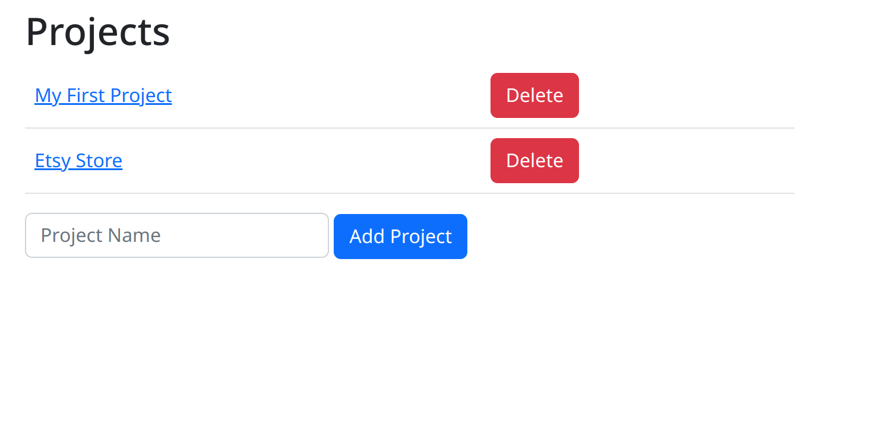
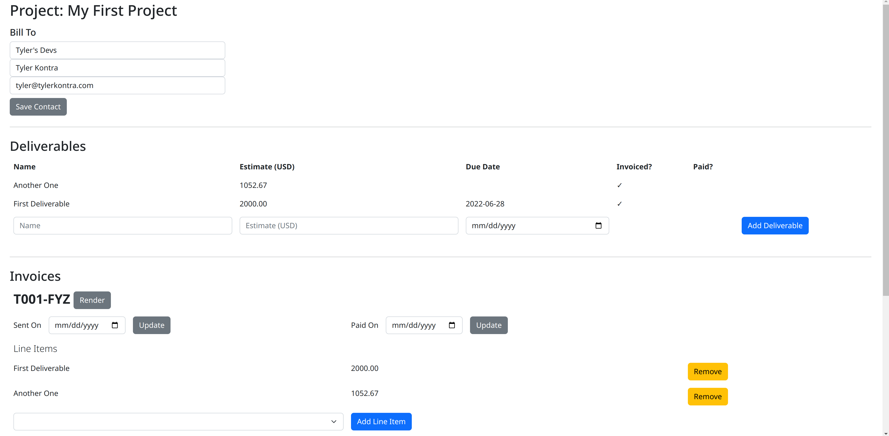
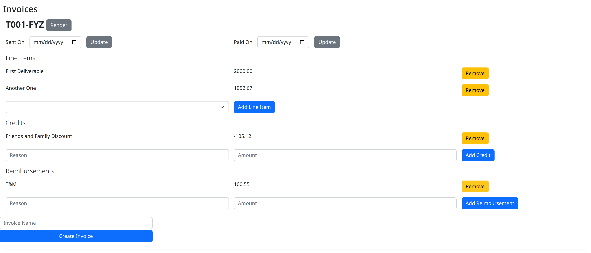
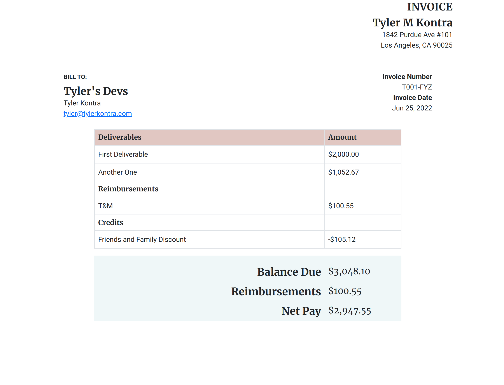

# deliverables

A very (very) simple web app to track deliverables and generate invoices.

### Purpose

I kept searching for an off-the-shelf invoicing app that would let me plug in "deliverables". No quantities,
no rates, just `deliverable X` costs `amount Y`.

I finally gave up and built this small app to do just that. I run it locally, and it saves to a sqlite database.

It starts with a "project", a container for deliverables and invoices. I add deliverables as they come up, and can plug them into an invoice as they are finished. This helps me track which deliverables have been invoiced, so I don't bill for the same thing twice.

### Screenshots

Project List (i.e. home screen, index)

Project Detail

Project Invoices List

Rendered Invoice (save to PDF via browser print dialog)

